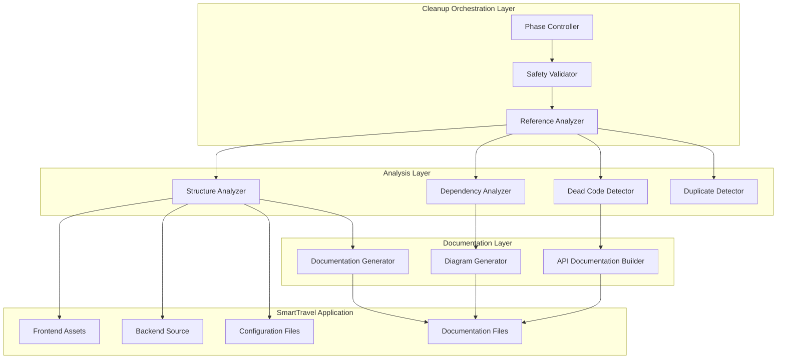
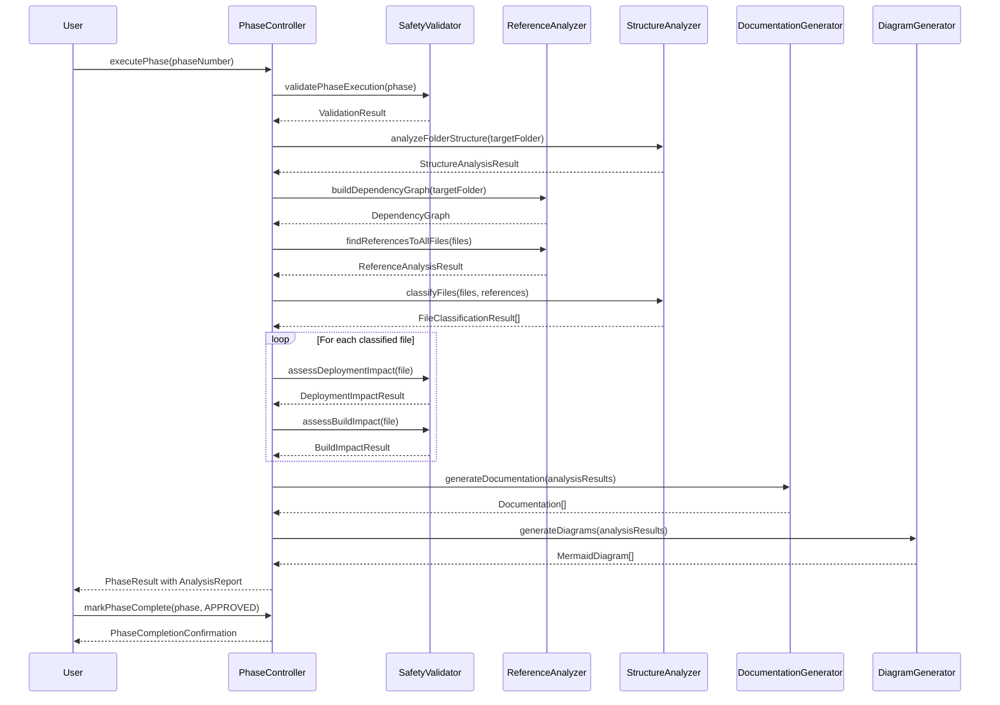
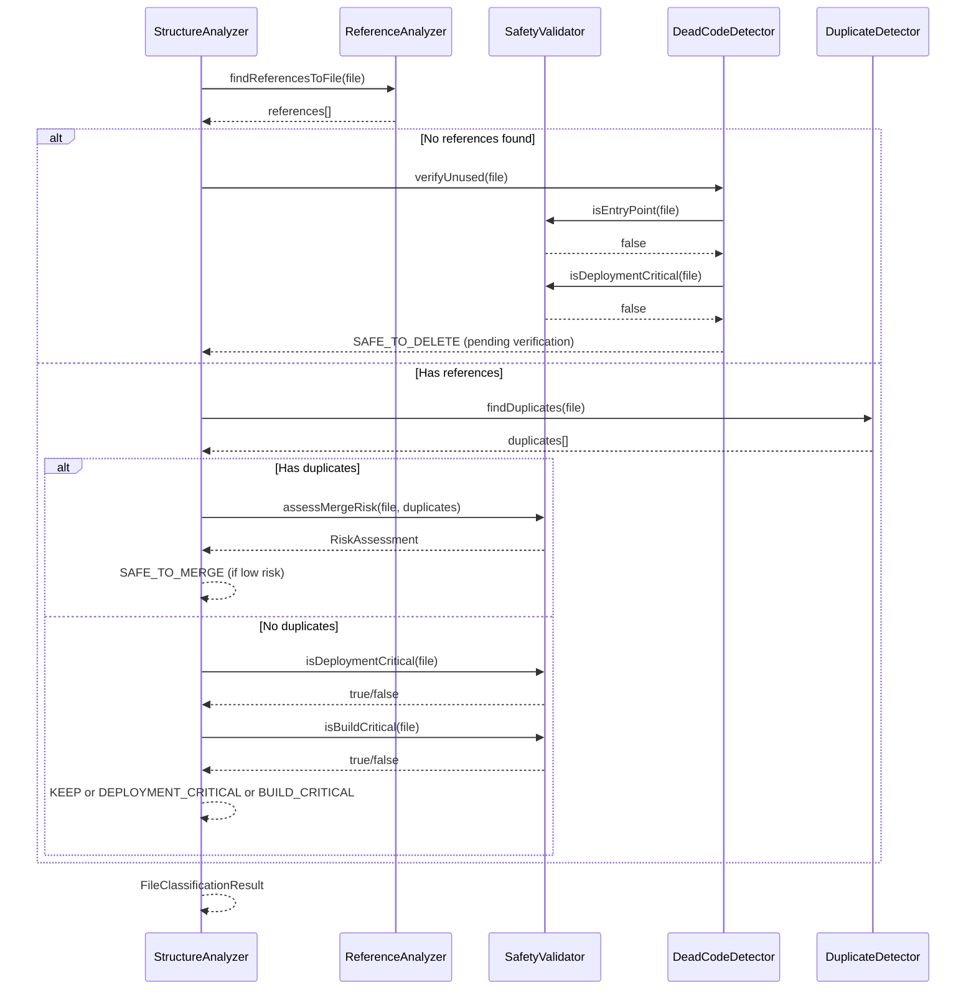
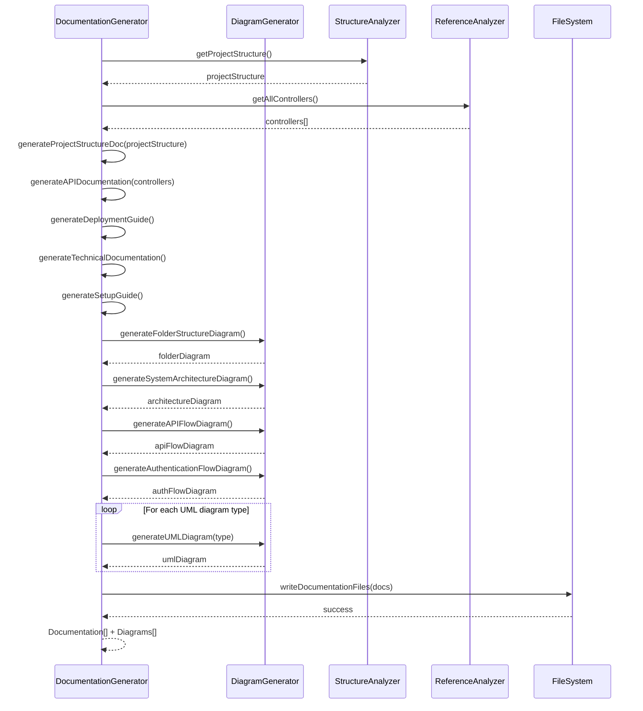

# Design Document: Project Cleanup and Deployment Preparation

## Overview

This design describes a systematic, safe, incremental approach to audit, clean, organize, document, and prepare the SmartTravel project for deployment. The process follows a folder-by-folder methodology across 19 distinct phases, ensuring zero breakage of functionality, routing, imports, assets, backend APIs, authentication, AI itinerary generation, budget generation, weather integration, maps integration, saved trips, database connectivity, or deployment readiness.

The cleanup process operates under a strict "audit-first, verify-all-references, wait-for-approval" protocol where no files are deleted, moved, renamed, or refactored without explicit verification of all dependencies and user approval. Each phase produces comprehensive analysis reports, risk assessments, and actionable recommendations while simultaneously building complete project documentation and architectural diagrams.

This design ensures the SmartTravel application—an AI-powered full-stack travel planning platform with HTML/CSS/JavaScript frontend, Spring Boot (Java 17) backend, MySQL database, and OpenRouter AI integration—remains fully functional throughout the entire cleanup and deployment preparation process.

## Architecture

### Overall Cleanup Architecture



### 19-Phase Cleanup Workflow


## Components and Interfaces

### Component 1: PhaseController

**Purpose**: Orchestrates the execution of each cleanup phase, maintains phase state, enforces sequential execution, and coordinates between analysis, documentation, and safety validation components.

**Interface**:
```java
interface PhaseController {
  PhaseResult executePhase(PhaseNumber phase)
  PhaseStatus getCurrentPhase()
  boolean canProceedToNextPhase()
  void markPhaseComplete(PhaseNumber phase, ApprovalStatus approval)
  List<PhaseResult> getAllCompletedPhases()
}
```

**Responsibilities**:
- Execute phases sequentially (1 through 19)
- Prevent parallel phase execution
- Maintain phase completion state
- Coordinate with SafetyValidator before any file operations
- Generate phase transition reports

### Component 2: SafetyValidator

**Purpose**: Validates all operations against safety rules, prevents destructive operations without approval, verifies all file references before classification, and enforces the "audit-first, verify-all, wait-for-approval" protocol.

**Interface**:
```java
interface SafetyValidator {
  ValidationResult validateFileOperation(FileOperation operation)
  boolean requiresUserApproval(FileOperation operation)
  ReferenceCheckResult checkAllReferences(File file)
  DeploymentImpact assessDeploymentImpact(FileOperation operation)
  BuildImpact assessBuildImpact(FileOperation operation)
}
```

**Responsibilities**:
- Block all delete/move/rename operations until approved
- Verify file references across entire codebase
- Assess deployment criticality
- Assess build criticality
- Generate risk assessment reports

### Component 3: ReferenceAnalyzer

**Purpose**: Scans the entire codebase to find all references to files, functions, classes, imports, assets, routes, and API endpoints. Provides comprehensive dependency mapping.

**Interface**:
```java
interface ReferenceAnalyzer {
  List<FileReference> findReferencesToFile(File file)
  DependencyGraph buildDependencyGraph(Folder folder)
  List<Import> findAllImports(File file)
  List<Route> findAllRoutes(File file)
  List<ApiEndpoint> findApiEndpointUsages(String endpoint)
}
```

**Responsibilities**:
- Scan JavaScript files for imports and function calls
- Scan Java files for imports and class references
- Scan HTML files for script tags, link tags, and asset references
- Scan CSS files for @import and url() references
- Build complete dependency graph
- Identify unused files (zero references)

### Component 4: StructureAnalyzer

**Purpose**: Analyzes folder structure, file organization, naming conventions, and provides insights into project organization quality.

**Interface**:
```java
interface StructureAnalyzer {
  FolderStructure analyzeFolderStructure(Folder folder)
  List<NamingIssue> detectNamingIssues(Folder folder)
  List<OrganizationIssue> detectOrganizationIssues(Folder folder)
  FileClassificationResult classifyFiles(Folder folder)
}
```

**Responsibilities**:
- List all files in target folder
- Detect file type (source, config, asset, documentation)
- Identify naming convention violations
- Detect misplaced files
- Classify files into KEEP/DELETE/MERGE/VERIFY/DEPLOYMENT_CRITICAL/BUILD_CRITICAL

### Component 5: DependencyAnalyzer

**Purpose**: Analyzes dependencies between files, modules, and external libraries. Detects circular dependencies, unused dependencies, and missing dependencies.

**Interface**:
```java
interface DependencyAnalyzer {
  DependencyTree buildDependencyTree(File rootFile)
  List<CircularDependency> detectCircularDependencies(Folder folder)
  List<Dependency> findUnusedDependencies(Project project)
  List<Dependency> findMissingDependencies(Project project)
}
```

**Responsibilities**:
- Build dependency tree for each file
- Detect circular import cycles
- Identify unused npm packages or Maven dependencies
- Identify missing dependencies causing build failures
- Generate dependency visualization diagrams

### Component 6: DeadCodeDetector

**Purpose**: Identifies unused files, functions, classes, variables, and assets that are not referenced anywhere in the codebase.

**Interface**:
```java
interface DeadCodeDetector {
  List<File> findUnusedFiles(Folder folder)
  List<Function> findUnusedFunctions(File file)
  List<Class> findUnusedClasses(File file)
  List<Asset> findUnusedAssets(Folder assetFolder)
}
```

**Responsibilities**:
- Scan entire codebase for references
- Mark files with zero references as potentially unused
- Verify unused files are not entry points (index.html, main.js, etc.)
- Verify unused files are not deployment critical (pom.xml, package.json, etc.)
- Generate unused file reports

### Component 7: DuplicateDetector

**Purpose**: Detects duplicate files (exact copies), similar files (near-duplicates), and duplicate code blocks within files.

**Interface**:
```java
interface DuplicateDetector {
  List<DuplicateFilePair> findDuplicateFiles(Folder folder)
  List<SimilarFilePair> findSimilarFiles(Folder folder, double threshold)
  List<DuplicateCode> findDuplicateCodeBlocks(File file)
}
```

**Responsibilities**:
- Calculate file hashes to detect exact duplicates
- Use similarity algorithms to detect near-duplicates
- Detect duplicate functions/classes
- Generate merge recommendations
- Assess risk of merging duplicate files

### Component 8: DocumentationGenerator

**Purpose**: Generates comprehensive project documentation including setup guides, architecture documentation, API reference, and deployment guides.

**Interface**:
```java
interface DocumentationGenerator {
  Document generateProjectStructure(Project project)
  Document generateDeploymentGuide(Project project)
  Document generateTechnicalDocumentation(Project project)
  Document generateAPIDocumentation(List<Controller> controllers)
  Document generateSetupGuide(Project project)
}
```

**Responsibilities**:
- Extract project structure from folder analysis
- Document all REST API endpoints
- Document authentication flows
- Document database schema
- Document AI integration
- Generate markdown documentation files

### Component 9: DiagramGenerator

**Purpose**: Generates Mermaid diagrams for system architecture, folder structure, component relationships, data flow, and sequence diagrams.

**Interface**:
```java
interface DiagramGenerator {
  MermaidDiagram generateFolderStructureDiagram(Project project)
  MermaidDiagram generateSystemArchitectureDiagram(Project project)
  MermaidDiagram generateFrontendArchitectureDiagram(Frontend frontend)
  MermaidDiagram generateBackendArchitectureDiagram(Backend backend)
  MermaidDiagram generateDependencyDiagram(DependencyGraph graph)
  MermaidDiagram generateNavigationFlowDiagram(Frontend frontend)
  MermaidDiagram generateAPIFlowDiagram(List<Controller> controllers)
  MermaidDiagram generateAuthenticationFlowDiagram(SecurityConfig security)
  MermaidDiagram generateUseCaseDiagram(List<Feature> features)
  MermaidDiagram generateActivityDiagram(Workflow workflow)
  MermaidDiagram generateClassDiagram(List<Entity> entities)
  MermaidDiagram generateComponentDiagram(Architecture architecture)
  MermaidDiagram generateDeploymentDiagram(DeploymentConfig config)
  MermaidDiagram generateSequenceDiagram(ApiFlow flow)
}
```

**Responsibilities**:
- Generate folder tree diagram
- Generate system architecture overview
- Generate frontend component architecture
- Generate backend layer architecture
- Generate dependency graph visualization
- Generate navigation flow for frontend routes
- Generate API endpoint flow diagrams
- Generate authentication/authorization sequence diagrams
- Generate UML diagrams (Use Case, Activity, Class, Component, Deployment, Sequence)

## Data Models

### Model 1: PhaseResult

```java
interface PhaseResult {
  phaseNumber: Integer
  phaseName: String
  status: PhaseStatus  // PENDING, IN_PROGRESS, COMPLETED, FAILED
  startTime: Timestamp
  endTime: Timestamp
  analysisReport: AnalysisReport
  documentationGenerated: List<Document>
  diagramsGenerated: List<MermaidDiagram>
  filesAnalyzed: Integer
  filesClassified: Map<FileClassification, Integer>
  approvalRequired: Boolean
  approvalStatus: ApprovalStatus  // PENDING, APPROVED, REJECTED
}
```

**Validation Rules**:
- phaseNumber must be between 1 and 19
- status must transition in order: PENDING → IN_PROGRESS → COMPLETED/FAILED
- endTime must be after startTime
- filesAnalyzed must be non-negative

### Model 2: AnalysisReport

```java
interface AnalysisReport {
  phaseNumber: Integer
  targetFolder: String
  structureAnalysis: StructureAnalysisResult
  dependencyAnalysis: DependencyAnalysisResult
  referenceAnalysis: ReferenceAnalysisResult
  duplicateDetection: DuplicateDetectionResult
  deadCodeDetection: DeadCodeDetectionResult
  deploymentImpactAssessment: DeploymentImpactResult
  buildImpactAssessment: BuildImpactResult
  riskAssessment: RiskAssessmentResult
  recommendations: List<Recommendation>
}
```

**Validation Rules**:
- targetFolder must exist in the project
- All analysis results must be non-null
- recommendations list can be empty but not null

### Model 3: FileClassificationResult

```java
interface FileClassificationResult {
  filePath: String
  classification: FileClassification  // KEEP, SAFE_TO_DELETE, SAFE_TO_MERGE, NEEDS_VERIFICATION, DEPLOYMENT_CRITICAL, BUILD_CRITICAL
  referenceCount: Integer
  referencedBy: List<String>
  imports: List<String>
  exports: List<String>
  reason: String
  riskLevel: RiskLevel  // LOW, MEDIUM, HIGH, CRITICAL
  deploymentCritical: Boolean
  buildCritical: Boolean
}
```

**Validation Rules**:
- filePath must be valid absolute path
- referenceCount must be non-negative
- reason must be provided for all classifications
- DEPLOYMENT_CRITICAL and BUILD_CRITICAL files must have riskLevel = CRITICAL

### Model 4: DependencyGraph

```java
interface DependencyGraph {
  nodes: List<DependencyNode>
  edges: List<DependencyEdge>
  circularDependencies: List<CircularDependency>
  rootNodes: List<DependencyNode>
  leafNodes: List<DependencyNode>
}

interface DependencyNode {
  filePath: String
  fileType: String
  dependsOn: List<String>
  dependedBy: List<String>
}

interface DependencyEdge {
  source: String
  target: String
  edgeType: DependencyType  // IMPORT, REFERENCE, ASSET, ROUTE, API_CALL
}
```

**Validation Rules**:
- All edge sources and targets must exist in nodes list
- circularDependencies must reference valid nodes
- rootNodes have no incoming edges
- leafNodes have no outgoing edges

### Model 5: FileOperation

```java
interface FileOperation {
  operationType: OperationType  // DELETE, MOVE, RENAME, MERGE, REFACTOR
  targetFile: String
  destinationPath: String  // for MOVE/RENAME
  mergeIntoFile: String  // for MERGE
  reason: String
  impactAssessment: ImpactAssessment
  requiresApproval: Boolean
  approvalStatus: ApprovalStatus
}
```

**Validation Rules**:
- operationType must be valid enum value
- targetFile must exist
- destinationPath required for MOVE/RENAME operations
- mergeIntoFile required for MERGE operations
- reason must be non-empty
- requiresApproval must be true for DELETE/MOVE/RENAME/MERGE

### Model 6: SmartTravelProject

```java
interface SmartTravelProject {
  projectRoot: String
  frontend: Frontend
  backend: Backend
  database: Database
  documentation: Documentation
  deployment: DeploymentConfig
  buildConfig: BuildConfig
}

interface Frontend {
  rootPath: String
  indexHtml: String
  assets: Folder
  components: Folder
  css: Folder
  javascript: Folder
  pages: Folder
  routes: List<Route>
}

interface Backend {
  rootPath: String
  sourceRoot: String
  config: Folder
  controllers: List<Controller>
  services: List<Service>
  repositories: List<Repository>
  entities: List<Entity>
  dtos: List<DTO>
  security: SecurityConfig
  utilities: Folder
  tests: Folder
}
```

**Validation Rules**:
- projectRoot must exist and be absolute path
- frontend.indexHtml must exist
- backend.sourceRoot must exist
- All folder references must exist

## Sequence Diagrams

### Phase Execution Sequence



### File Classification Sequence



### Documentation Generation Sequence



## Error Handling

### Error Scenario 1: File Reference Check Fails

**Condition**: Reference analyzer cannot complete scanning due to syntax errors or missing files
**Response**: Mark file as NEEDS_VERIFICATION, log specific error, continue with remaining files
**Recovery**: Provide manual verification checklist to user, allow user to confirm file classification

### Error Scenario 2: Circular Dependency Detected

**Condition**: Dependency analyzer finds circular import cycles
**Response**: Document circular dependency in analysis report, mark all involved files as NEEDS_VERIFICATION
**Recovery**: Generate dependency diagram showing cycle, provide refactoring recommendations

### Error Scenario 3: Deployment-Critical File Marked for Deletion

**Condition**: User attempts to approve deletion of file marked DEPLOYMENT_CRITICAL
**Response**: Block deletion, display critical warning, require explicit override confirmation
**Recovery**: Show deployment impact assessment, list all dependencies, require double confirmation

### Error Scenario 4: Phase Execution Fails Mid-Analysis

**Condition**: Analysis process crashes or times out during phase execution
**Response**: Save partial analysis results, mark phase as FAILED, log error details
**Recovery**: Allow phase restart from beginning, preserve previously completed phases

### Error Scenario 5: Duplicate Detection False Positives

**Condition**: Duplicate detector identifies files as duplicates that have subtle but critical differences
**Response**: Mark duplicates as NEEDS_VERIFICATION, display diff comparison
**Recovery**: Allow user to confirm files are truly identical before marking SAFE_TO_MERGE

## Testing Strategy

### Unit Testing Approach

Each component will be tested in isolation with mocked dependencies:

**ReferenceAnalyzer Tests**:
- Test finding JavaScript imports (ES6, CommonJS, AMD)
- Test finding Java imports and class references
- Test finding HTML asset references (script, link, img tags)
- Test finding CSS references (@import, url())
- Test handling of missing files gracefully

**StructureAnalyzer Tests**:
- Test file classification logic
- Test naming convention detection
- Test organization issue detection
- Test folder structure analysis

**DeadCodeDetector Tests**:
- Test unused file detection with zero references
- Test false positive prevention (entry points, config files)
- Test unused function detection within files
- Test unused asset detection

**SafetyValidator Tests**:
- Test deployment criticality assessment (pom.xml, package.json, index.html, etc.)
- Test build criticality assessment (mvnw, build scripts, config files)
- Test file operation validation (block destructive operations)
- Test reference verification before classification

**DuplicateDetector Tests**:
- Test exact duplicate detection using file hashes
- Test near-duplicate detection using similarity threshold
- Test duplicate code block detection
- Test merge recommendation generation

**DocumentationGenerator Tests**:
- Test project structure documentation generation
- Test API documentation extraction from controllers
- Test deployment guide generation
- Test technical documentation generation

**DiagramGenerator Tests**:
- Test Mermaid syntax generation for all diagram types
- Test folder tree diagram generation
- Test system architecture diagram generation
- Test UML diagram generation (class, sequence, component, etc.)

### Integration Testing Approach

Test complete phase execution workflows:

**Phase Execution Integration Tests**:
- Test complete phase 1 execution (README.md audit)
- Test phase transition from phase N to phase N+1
- Test phase failure and recovery
- Test phase approval workflow
- Test documentation generation during phase execution

**End-to-End Cleanup Workflow Tests**:
- Test cleanup of small sample project with known structure
- Verify no files deleted without approval
- Verify all references checked before classification
- Verify documentation generated incrementally
- Verify diagrams updated after each phase

**Safety Validation Integration Tests**:
- Test detection of deployment-critical files across all phases
- Test prevention of destructive operations
- Test risk assessment accuracy
- Test deployment impact assessment

## Performance Considerations

**Reference Scanning Performance**:
- Implement parallel file scanning for large codebases
- Cache reference analysis results between phases
- Use efficient regex patterns for import/reference detection
- Limit depth of dependency tree traversal to prevent infinite loops

**Duplicate Detection Performance**:
- Use hash-based comparison for exact duplicates (O(n) instead of O(n²))
- Use sampling for similarity detection on large files
- Set reasonable similarity threshold (e.g., 85%) to balance precision and recall
- Cache file hashes to avoid recomputation

**Documentation Generation Performance**:
- Generate documentation incrementally after each phase
- Avoid regenerating unchanged documentation sections
- Use templates for common documentation patterns
- Stream large documentation files to disk instead of keeping in memory

**Diagram Generation Performance**:
- Generate diagrams asynchronously
- Cache diagram structure between phases
- Only regenerate diagrams when underlying data changes
- Use efficient graph algorithms for dependency visualization

## Security Considerations

**File System Access**:
- Validate all file paths to prevent directory traversal attacks
- Use absolute paths consistently
- Verify file permissions before read/write operations
- Sanitize user-provided folder paths

**Configuration File Security**:
- Never log or display sensitive data from .env files or application.properties
- Warn user when analyzing files that may contain secrets
- Provide option to exclude sensitive folders from analysis
- Mask passwords and API keys in generated documentation

**Code Injection Prevention**:
- Do not execute code found in files during analysis
- Use static analysis only (AST parsing, regex matching)
- Validate all file operations before execution
- Prevent evaluation of user-provided expressions

**Data Privacy**:
- Keep all analysis results local (no external API calls)
- Do not transmit file contents to external services
- Provide option to redact sensitive information from reports
- Allow user to review all generated documentation before committing

## Dependencies

### Analysis Dependencies
- AST parser for JavaScript (e.g., Acorn, Esprima)
- AST parser for Java (e.g., JavaParser)
- HTML parser (e.g., Cheerio, jsdom)
- CSS parser (e.g., PostCSS, css-tree)
- File system utilities (Node.js fs, Java NIO)
- Diff utility for duplicate comparison

### Documentation Dependencies
- Markdown generation library
- Mermaid diagram syntax generator
- Template engine (e.g., Handlebars, Mustache)
- File writer utilities

### Validation Dependencies
- Path validation library
- File hash calculator (MD5, SHA-256)
- Regex library for pattern matching
- Graph algorithms library (for circular dependency detection)

### SmartTravel Project Dependencies (Must Preserve)
- **Frontend**: HTML, CSS, Vanilla JavaScript (no build tools)
- **Backend**: Spring Boot 4.0.5, Java 17, Maven
- **Database**: MySQL 8+, JPA/Hibernate
- **AI Integration**: OpenRouter API, OkHttp client
- **Security**: Spring Security (session-based)
- **Utilities**: Apache Commons CSV, Jackson JSON, Lombok

## Correctness Properties

*A property is a characteristic or behavior that should hold true across all valid executions of a system—essentially, a formal statement about what the system should do. Properties serve as the bridge between human-readable specifications and machine-verifiable correctness guarantees.*

### Property 1: Phase Sequential Execution
**Statement**: ∀ phases p₁, p₂ where p₁.number < p₂.number, p₂ cannot start until p₁ is marked COMPLETED
**Verification**: Test phase controller enforces sequential execution, attempting to start phase N+1 while phase N is IN_PROGRESS should fail
**Validates: Requirement 2.4**

### Property 2: Reference Integrity Before Classification
**Statement**: ∀ files f, classification(f) requires referenceAnalysis(f) to complete successfully
**Verification**: Test that file classification is blocked when reference analysis fails, verify ReferenceAnalyzer is called before StructureAnalyzer.classifyFiles
**Validates: Requirements 5.1, 5.2, 5.3, 5.4**

### Property 3: No Destructive Operations Without Approval
**Statement**: ∀ operations op where op.type ∈ {DELETE, MOVE, RENAME, MERGE}, op.approvalStatus must be APPROVED before execution
**Verification**: Test SafetyValidator blocks all destructive operations, attempting to execute DELETE without approval should throw exception
**Validates: Requirements 13.1, 13.2, 13.3, 13.4**

### Property 4: Deployment-Critical Files Never Marked SAFE_TO_DELETE
**Statement**: ∀ files f where f.deploymentCritical = true, classification(f) ≠ SAFE_TO_DELETE
**Verification**: Test SafetyValidator identifies deployment-critical files (pom.xml, index.html, etc.), verify classification logic excludes them from deletion candidates
**Validates: Requirements 6.1, 6.2, 6.3, 6.4**

### Property 5: Build-Critical Files Never Marked SAFE_TO_DELETE
**Statement**: ∀ files f where f.buildCritical = true, classification(f) ≠ SAFE_TO_DELETE
**Verification**: Test SafetyValidator identifies build-critical files (mvnw, build scripts), verify classification logic excludes them from deletion candidates
**Validates: Requirements 7.1, 7.2, 7.3, 7.4**

### Property 6: Documentation Generated After Each Phase
**Statement**: ∀ phases p where p.status = COMPLETED, ∃ documentation d where d.phase = p.number
**Verification**: Test DocumentationGenerator is invoked after every phase, verify documentation files exist after phase completion
**Validates: Requirements 11.1, 11.2, 11.3, 11.4, 11.5, 30.1, 30.2, 30.3, 30.4**

### Property 7: Circular Dependencies Detected and Reported
**Statement**: ∀ circular dependencies c in dependencyGraph, c ∈ analysisReport.circularDependencies
**Verification**: Test DependencyAnalyzer detects all circular import cycles, verify cycles are documented in analysis report
**Validates: Requirements 16.1, 16.2, 16.3, 16.4, 16.5**

### Property 8: Reference Count Accuracy
**Statement**: ∀ files f, f.referenceCount = |{r | r references f}|
**Verification**: Test ReferenceAnalyzer counts all references correctly, verify count matches actual number of import/reference statements
**Validates: Requirements 5.5, 10.1, 10.2, 38.1, 38.2, 38.3, 38.4, 38.5**

### Property 9: Zero-Reference Files Verified Before Deletion
**Statement**: ∀ files f where f.referenceCount = 0 AND classification(f) = SAFE_TO_DELETE, f.isEntryPoint = false AND f.deploymentCritical = false AND f.buildCritical = false
**Verification**: Test DeadCodeDetector verifies all zero-reference files are not entry points or critical files before marking as deletable
**Validates: Requirements 8.1, 8.2, 8.3, 8.4, 8.5**

### Property 10: All File Operations Have Reason and Impact Assessment
**Statement**: ∀ file operations op, op.reason ≠ null AND op.impactAssessment ≠ null
**Verification**: Test FileOperation validation, attempting to create operation without reason or impact assessment should fail
**Validates: Requirements 14.1, 14.2, 14.3, 14.4, 14.5**

### Property 11: Git Safety on Cleanup Branch
**Statement**: ∀ destructive operations op where op.type ∈ {DELETE, MOVE, RENAME, MERGE}, Git.currentBranch ≠ "main" AND Git.currentBranch ≠ "master"
**Verification**: Test SafetyValidator blocks all destructive operations when current branch is main or master, verify cleanup branch is required
**Validates: Requirement 1.5**

### Property 12: Continuous Validation After Approval
**Statement**: ∀ file operations op where op.approvalStatus = APPROVED, deploymentValidation() executes before nextOperation()
**Verification**: Test that deployment validation is executed immediately after every approved operation, verify operations are halted if validation fails
**Validates: Requirements 3.1, 3.5**

### Property 13: Validation Failure Halts Operations
**Statement**: ∀ validation results v where v.status = FAILED, nextOperation() is blocked
**Verification**: Test that when any validation step fails (backend compile, frontend access, feature endpoints), no further operations are executed
**Validates: Requirement 3.5**

## Deployment Readiness Preservation

### Critical Deployment Files (Must Never Delete)
- **Backend**: pom.xml, mvnw, mvnw.cmd, application.properties, application.yml
- **Frontend**: index.html, all referenced scripts and stylesheets
- **Root**: .gitignore, .env.example, README.md
- **Database**: schema.sql, data.sql (if present)

### Critical Build Files (Must Never Delete)
- **Maven**: pom.xml, .mvn/ folder, mvnw, mvnw.cmd
- **Spring Boot**: SmarttravelApplication.java (main class)
- **Configuration**: all files in Backend/src/main/resources/

### Critical Runtime Files (Must Never Delete)
- **Entry Points**: index.html, SmarttravelApplication.java
- **Controllers**: all files in controller/ folder (expose REST APIs)
- **Services**: all files in service/ folder (business logic)
- **Repositories**: all files in repository/ folder (database access)
- **Entities**: all files in entity/ folder (JPA entities)
- **Security**: all files in security/ folder (authentication/authorization)

### Deployment Validation Checklist
After each phase, verify:
- [ ] Backend can still compile (`mvn clean compile`)
- [ ] Frontend entry point (index.html) is accessible
- [ ] All REST API endpoints are still registered
- [ ] Database entities are still mapped
- [ ] Authentication still works
- [ ] AI integration still works
- [ ] All referenced assets (CSS, JS, images) are still accessible
- [ ] No broken imports or missing dependencies

This design ensures the SmartTravel project remains fully functional and deployment-ready throughout the entire cleanup process by treating every file as critical until proven otherwise through comprehensive reference analysis and impact assessment.
