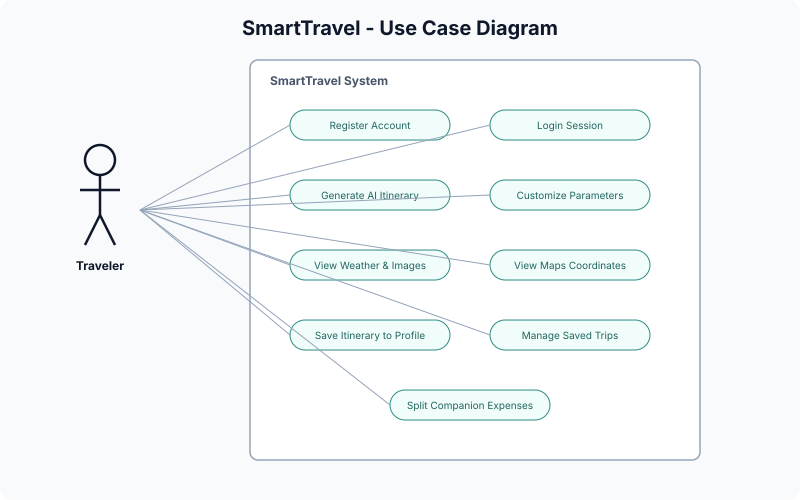
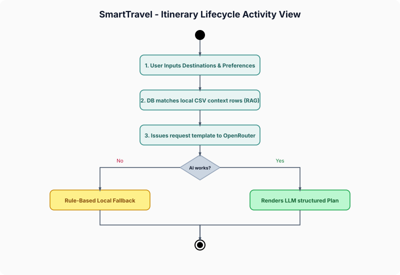
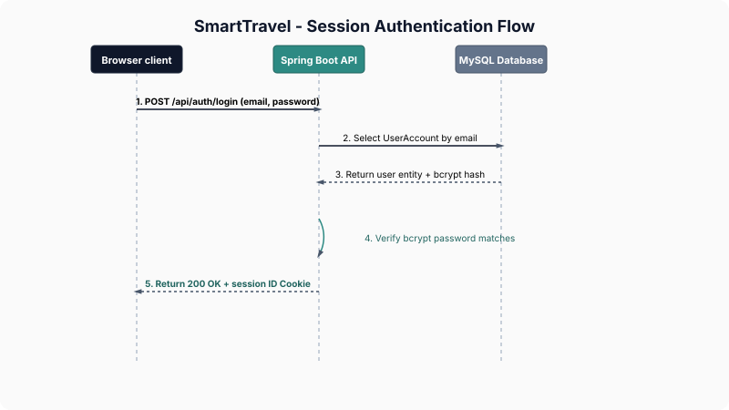

# SmartTravel - AI-Powered Travel Planner

[](https://spring.io/projects/spring-boot)
[](https://www.oracle.com/java/)
[](https://www.mysql.com/)
[](https://openrouter.ai/)
[](https://opensource.org/licenses/MIT)

SmartTravel is a full-stack, AI-powered travel planning web application built specifically for discovering and exploring travel destinations in India. It leverages a Retrieval-Augmented Generation (RAG) architecture to query a local MySQL database of curated destinations and merges it with generative intelligence via the OpenRouter (LLM) API to generate daily, optimized travel itineraries.

---

## Application Interface Screenshot

Below is the user interface of the SmartTravel platform homepage:


---

## Key Features

*   **Dual-Engine Travel Planner:** Generates multi-day travel plans using generative AI. If the external AI service is unavailable or key credentials are not provided, it seamlessly activates a deterministic, proximity-based fallback clustering algorithm that groups local destinations geographically.
*   **Secure Session Authentication:** Stateful, secure cookie-based login (JSESSIONID) with BCrypt password hashing.
*   **My Trips Dashboard:** Saves and manages customized itineraries dynamically tied to user profiles.
*   **Companion Split-Expense Calculator:** Built-in companion budgeting system to record expenses and dynamically compute split shares.
*   **Live Weather & Destination Insights:** Integrated weather profiles, photography spots, local tips, and nearest connectivity nodes (airports, railways).
*   **Interactive Maps Integration:** Renders map locations using destination coordinates.

---

## Project Directory Tree

Below is the repository directory structure showing the organization of both frontend, backend, dataset seeding tools, and system documentation:

```text
SmartTravel/
├── Backend/                 # Spring Boot backend source code
│   ├── src/                 # Java source packages and configuration properties
│   └── pom.xml              # Maven dependencies configuration
├── Frontend/                # Vanilla HTML5 / CSS3 / ES6 JavaScript client
│   ├── css/                 # Styling components and custom design tokens
│   ├── js/                  # Modular client-side page controllers and API wrappers
│   ├── pages/               # Client sub-views (auth, planner, itinerary panels)
│   └── index.html           # Application dashboard entry point
├── datasets/                # Local dataset resources
│   └── india_travel_dataset_cleaned_v2.csv
├── docs/                    # Unified system documentation hub
│   └── diagrams/            # Unified system diagrams, models, and screenshots
│       └── svg/             # Rendered vector diagram assets
└── scripts/                 # Importer utilities and compilation scripts
    ├── generate_svgs.py     # Programmatic vector graphics renderer
    └── import_csv.py        # Database loader utility
```

---

## System Architecture

SmartTravel follows a standard 3-Tier Architecture that enforces clean separation of concerns between client views, logical controllers/services, and databases.

### System Architecture Flow


---

## Visual Workflows and System Specifications

All diagram models are pre-rendered in clean default themes and placed directly under docs/diagrams/svg/ to document system operations:

### SRS Use Case Model
Represents the Traveler actor interaction options and access parameters inside the platform:


### Itinerary Planning Workflow
Outlines the logic from user preferences selection down to RAG database candidate retrieval and AI generation fallback:


### Session Authentication Sequence
Details the stateful credentials verification loop and session cookie validation checks:


---

## Technology Stack

| Component | Technology | Description |
|---|---|---|
| **Frontend** | Vanilla HTML5 / CSS3 / ES6 Javascript | Clean, modern user interface utilizing HSL tailored colors, responsive CSS grids, and smooth micro-animations. |
| **Backend** | Spring Boot 3.x, Java 17 | Core web controllers, REST APIs, JPA mapping, and service layers. |
| **Database** | MySQL 8+ / Hibernate JPA | Relational tables mapping places, user sessions, saved trips, and group budgets. |
| **AI Integration** | OpenRouter API / OkHttp client | Integrates with generative models (e.g. gpt-4o-mini) using structured JSON templates. |
| **Data Processing** | Python, Commons CSV | Pre-processing scripts and loader tools to ingest dataset profiles. |

---

## Quick Start Guide

### 1. Prerequisites
*   Java Development Kit (JDK) 17 or higher
*   Maven 3.x (or use the included wrapper ./mvnw)
*   MySQL Server 8.x
*   Python 3.x (for database seeding)

### 2. Configure Database & Environment
1.  Log into your MySQL terminal and create the schema:
    ```sql
    CREATE DATABASE smart_travel;
    ```
2.  Copy the example environment file and fill in your values:
    ```bash
    cp .env.example .env
    ```
    Configure the following keys:
    ```env
    OPENROUTER_API_KEY=your_api_key
    MYSQL_DATABASE=smart_travel
    MYSQL_USERNAME=root
    MYSQL_PASSWORD=your_password
    ```

### 3. Seed the Database
Run the Python CSV importer script to populate the local destinations database with the curated Indian dataset containing tourist places:
```bash
python scripts/import_csv.py
```

### 4. Build and Run the Backend Server
Navigate into the Backend/ directory and spin up the spring-boot server:
```powershell
cd Backend
.\mvnw.cmd clean spring-boot:run
```
The server will boot up and bind to port 9090.

### 5. Access the Platform
Open your browser and navigate to:
```text
http://localhost:9090/
```

---

## System Documentation

Technical design documents and guides are structured inside the docs/ directory:

*   **[Software Requirements Specification (SRS)](docs/SRS.md):** Detailed system objectives, personas, and use cases.
*   **[System Architecture Specification](docs/ARCHITECTURE.md):** In-depth structural model, packages, database design schemas, and technical debt log.
*   **[REST API Specification](docs/API.md):** Request/Response payloads, schemas, and authentication filters.
*   **[Deployment & Setup Specification](docs/DEPLOYMENT.md):** Detailed environment configurations, database seeding methods, and deployment instructions.

---

## License
This project is licensed under the MIT License. See the LICENSE file for details.
