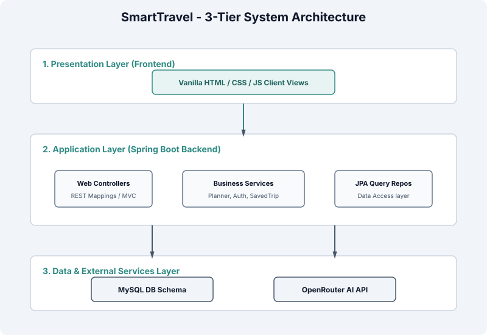
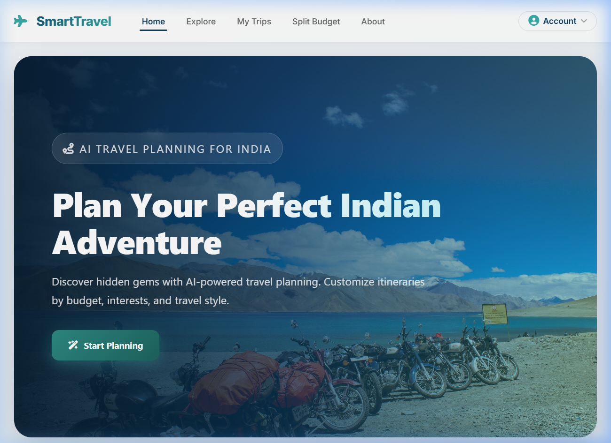
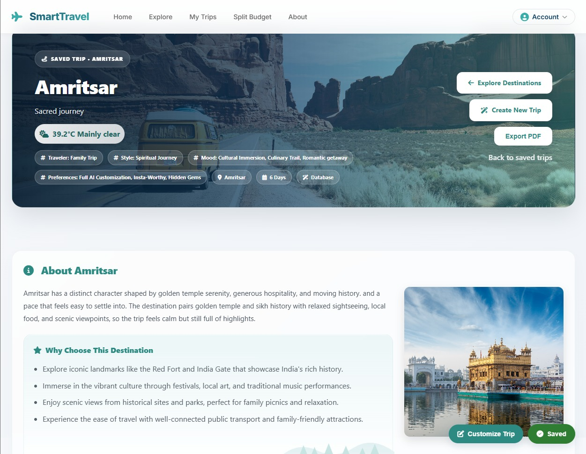

# SmartTravel - AI-Powered Travel Planner

[](https://spring.io/projects/spring-boot)
[](https://www.oracle.com/java/)
[](https://www.mysql.com/)
[](https://openrouter.ai/)

SmartTravel is a full-stack, AI-powered travel planning web application built specifically for discovering and exploring travel destinations in India. It leverages a Retrieval-Augmented Generation (RAG) architecture to query a local MySQL database of curated destinations and merges it with generative intelligence via the OpenRouter (LLM) API to generate daily, optimized travel itineraries.

---

## Project Overview

SmartTravel is designed to simplify the complex process of planning multi-day trips. By combining a curated offline dataset of Indian tourist attractions with real-time generative language models, the application constructs personalized itineraries customized to user budget comfort levels, timeline constraints, travel styles, and mood preferences. 

The application architecture prioritizes reliability by utilizing a local database fallback engine that dynamically clusters nearby locations using geocoordinates if external services time out or are unconfigured. The platform also offers secure session authentication and companion budget tools, resolving all core aspects of trip organization in a single dashboard.

---

## Features

*   **Dual-Engine Travel Planner:** Generates multi-day travel plans using generative AI. If the external AI service is unavailable or key credentials are not provided, it seamlessly activates a deterministic, proximity-based fallback clustering algorithm that groups local destinations geographically.
*   **Secure Session Authentication:** Stateful, secure cookie-based login (JSESSIONID) with BCrypt password hashing.
*   **My Trips Dashboard:** Saves and manages customized itineraries dynamically tied to user profiles.
*   **Companion Split-Expense Calculator:** Built-in companion budgeting system to record expenses and dynamically compute split shares.
*   **Live Weather & Destination Insights:** Integrated weather profiles, photography spots, local tips, and nearest connectivity nodes (airports, railways).
*   **Interactive Maps Integration:** Renders map locations using destination coordinates.

---

## Tech Stack

| Component | Technology | Description |
|---|---|---|
| **Frontend** | Vanilla HTML5 / CSS3 / ES6 JavaScript | Responsive user interface utilizing custom design tokens, CSS grids, and smooth micro-animations. |
| **Backend** | Spring Boot 3.x, Java 17 | REST controller mappings, JPA transactions, security authorization filters, and core planner pipelines. |
| **Database** | MySQL 8+ / Hibernate JPA | Transactional schemas for profiles, budget sheets, expense logs, and places. |
| **AI Integration** | OpenRouter API / OkHttp client | Prompt engineering templates connecting to gpt-4o-mini for structured itinerary outputs. |
| **Data Processing** | Python, Commons CSV | Importer loaders to parse and seed dataset values into database schemas. |

---

## Architecture

SmartTravel follows a standard 3-Tier Architecture that enforces clean separation of concerns between client views, logical controllers/services, and databases.

### 3-Tier System Architecture Flow
Defines the connection paths between client presentation layer, Spring Boot logic layer, MySQL storage, and external OpenRouter API:


---

## Screenshots

### Homepage Dashboard
Defines the landing dashboard where travelers can register, authenticate, and explore custom recommendations.


### Itinerary Planner Wizard
The multi-step interactive wizard where users customize destinations, travel length, companion counts, and categories.


### Destinations Explorer
Allows travelers to search, browse, and filter tourist spots by region, category, rating, and crowd levels.


### Generated Travel Itinerary
Displays the detailed daily schedule containing curated spots, tips, duration suggestions, and companion splits.


---

## Project Structure

Below is the repository directory structure showing the organization of both frontend, backend, dataset seeding tools, and system documentation:

```text
SmartTravel/
├── Backend/                 # Spring Boot backend source code
│   ├── src/                 # Java source packages and configuration properties
│   └── pom.xml              # Maven dependencies configuration
├── Frontend/                # Vanilla HTML5 / CSS3 / ES6 JavaScript client
│   ├── css/                 # Styling components and custom design tokens
│   ├── js/                  # Modular client-side page controllers and API wrappers
│   ├── pages/               # Client sub-views (auth, planner, itinerary panels)
│   └── index.html           # Application dashboard entry point
├── datasets/                # Local dataset resources
│   └── india_travel_dataset_cleaned_v2.csv
├── docs/                    # Unified system documentation hub
│   └── diagrams/            # Unified system diagrams, models, and screenshots
│       └── svg/             # Rendered vector diagram assets
└── scripts/                 # Importer utilities and compilation scripts
    ├── generate_svgs.py     # Programmatic vector graphics renderer
    └── import_csv.py        # Database loader utility
```

---

## Setup Instructions

### 1. Configure MySQL Schema
Start the local MySQL database instance, open your SQL client, and create the schema:
```sql
CREATE DATABASE smart_travel CHARACTER SET utf8mb4 COLLATE utf8mb4_unicode_ci;
```

### 2. Configure Environment Variables
Copy the example environment template file to create your active `.env` config file:
```bash
cp .env.example .env
```
Fill in the parameters as detailed in the Environment Variables section below.

### 3. Ingest Destinations Dataset
Execute the CSV importer script to populate the local attractions tables:
```bash
# Ingest using Python
python scripts/import_csv.py
```
Alternatively, execute the database loader from the backend directory using Maven:
```bash
cd Backend
./mvnw.cmd exec:java -Dexec.mainClass="com.riya.smarttravel.util.CsvImportTool"
```

### 4. Build and Launch Server
Run the Maven wrapper task to compile classes, run validation tests, and bootstrap Tomcat:
```bash
cd Backend
./mvnw.cmd clean spring-boot:run
```
The server binds to local port `9090`.

### 5. Open Application
Navigate your browser to the local URL:
```text
http://localhost:9090/
```

---

## Environment Variables

Configure the following variables in your `.env` file at the root of the project:

*   **`DB_URL`** (Default: `jdbc:mysql://localhost:3306/smart_travel`): The JDBC MySQL connection string.
*   **`DB_USERNAME`** (Default: `root`): Database authentication username.
*   **`DB_PASSWORD`** (Default: `root`): Database authentication password.
*   **`APP_CORS_ALLOWED_ORIGINS`**: Comma-separated list of origins permitted to call REST APIs.
*   **`OPENROUTER_API_KEY`**: API credential key for the OpenRouter model.
*   **`PLANNER_AI_MODEL`** (Default: `openai/gpt-4o-mini`): Generative AI model selection ID.
*   **`PLANNER_AI_ENABLED`** (Default: `true`): Feature toggle to enable/disable generative AI planning.
*   **`APP_FRONTEND_PATH`** (Default: `file:///d:/travel-planner/Frontend/`): Root file path mapping pointing to static frontend assets.

---

## Future Improvements

*   **Distributed Cache Configuration:** Replace in-memory caching blocks with a centralized cache store like Redis to persist weather details and geocoding responses.
*   **Stateless Authentication Protocols:** Migrate stateful Servlet session cookies (`HttpSession`) to stateless authorization protocols using JSON Web Tokens (JWT) for microservice scaling.
*   **Asynchronous Processing Pipeline:** Refactor geocoding and weather REST requests to run on asynchronous, non-blocking HTTP threads.
*   **Trip Collaboration Channels:** Extend budget calculators and itinerary modules to support real-time collaboration rooms for travel companion groups.

---

## System Documentation

Technical design documents and guides are structured inside the docs/ directory:

*   **[Software Requirements Specification (SRS)](docs/SRS.md):** Detailed system objectives, personas, and use cases.
*   **[System Architecture Specification](docs/ARCHITECTURE.md):** In-depth structural model, packages, database design schemas, and technical debt log.
*   **[REST API Specification](docs/API.md):** Request/Response payloads, schemas, and authentication filters.
*   **[Deployment & Setup Specification](docs/DEPLOYMENT.md):** Detailed environment configurations, database seeding methods, and deployment instructions.

