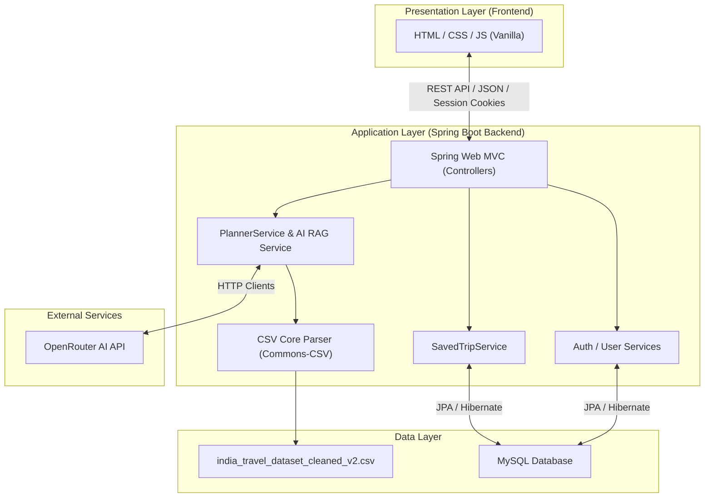

# Architecture Reference Guide - SmartTravel

## 1. System Overview

SmartTravel is structured as a classic 3-tier web application consisting of a presentation layer (Frontend), an application layer (Spring Boot Backend), and a storage layer (MySQL Database and local CSV datasets).

---

## 2. Layered Architecture

### 2.1 Presentation Layer (Frontend)
Built using vanilla web technologies (HTML5, CSS3, and JavaScript ES6) to ensure rapid loading, simple maintenance, and maximum browser compatibility.
- **`Frontend/css/design-tokens.css`**: Master stylesheets defining variables, root theme values (colors, sizing scales, border radii, shadows), and reset rules.
- **`Frontend/js/api.js`**: Core module containing fetch request wrappers, base URL configurations, and response parsing.
- **`Frontend/js/auth.js`**: Controls registration, login, and profile lifecycle bindings.
- **`Frontend/js/planner.js`**: Coordinates the multi-step trip wizard inputs and handles form submissions.
- **`Frontend/js/itinerary.js`**: Renders saved plans and handles delete actions.

### 2.2 Application Layer (Spring Boot Backend)
Employs Spring Boot for MVC routing, session management, transaction boundary configurations, and component injection.
- **`config`**: Holds static routing settings, MVC resource configurations, and security authorization rules.
- **`controller`**: Exposes REST interfaces mapped to `/api/*`, translating HTTP request payloads to service parameters.
- **`dto`**: Data Transfer Objects defining contracts for client requests and api responses.
- **`entity`**: Database model entities mapped via Hibernate annotations.
- **`repository`**: Database query access abstractions extending `JpaRepository`.
- **`service`**: Business logic implementations (RAG prompt creation, rule-based fallback, expense calculations).
- **`util`**: Utility classes (Input sanitizers, CSV parsers, HTTP API client setups).

### 2.3 Storage Layer
- **MySQL Database**: Stores persistent transactional data such as users accounts, saved travel plans, budget details, and expenses.
- **Curated Travel Dataset**: A local CSV file containing structured details of popular tourist spots in India, used by the backend to enrich LLM prompts or build rule-based plans.

---

## 3. Core Design Patterns

- **RAG Pattern (Retrieval-Augmented Generation)**:
  When generating an itinerary, the `PlannerService` queries the database (seeded from the CSV travel dataset) for real matching places in the requested city. If places are sparse, the service expands the candidate list with nearby attractions from the same state/region. It then compiles the descriptions of these real places into a prompt context template, which is sent to the LLM (via OpenRouter API). This guarantees that the AI suggests real, visitable attractions.
- **Local Database Fallback Pattern**:
  If the LLM API is unavailable, the backend groups the retrieved database candidates into days based on proximity (using latitude/longitude distance calculations) and outputs a fallback itinerary without failing the user request.
- **Session-Based Authentication Pattern**:
  A stateful authentication flow. The backend registers session identifiers (`JSESSIONID`) inside `HttpSession` upon successful credentials check. The custom `SessionAuthFilter` intercepts subsequent calls, verifies session validity, and sets Spring `SecurityContextHolder`.
