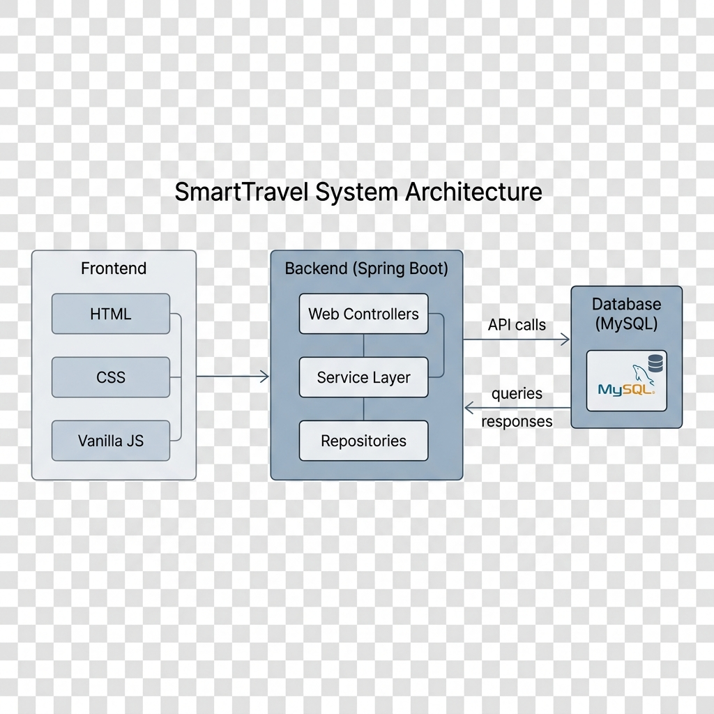
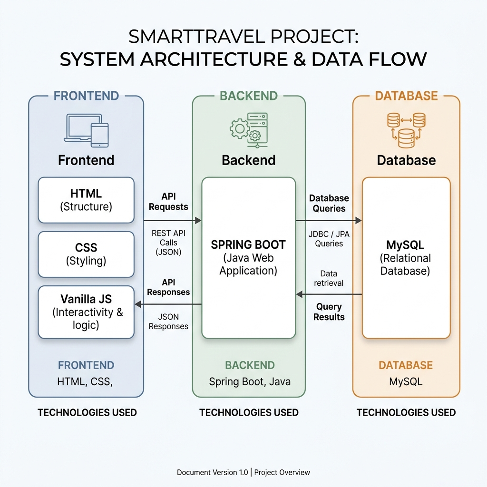
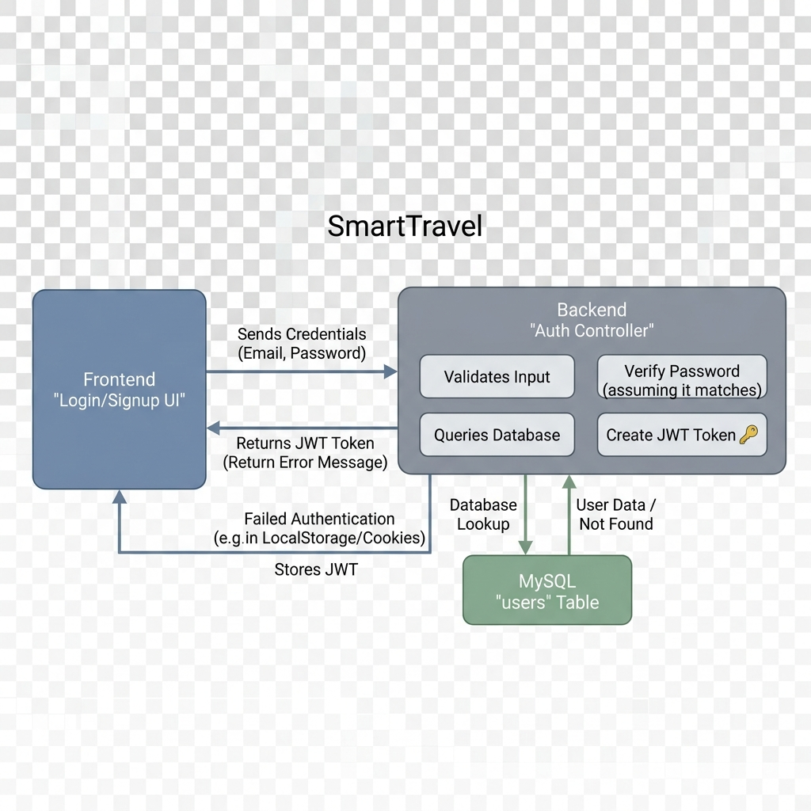
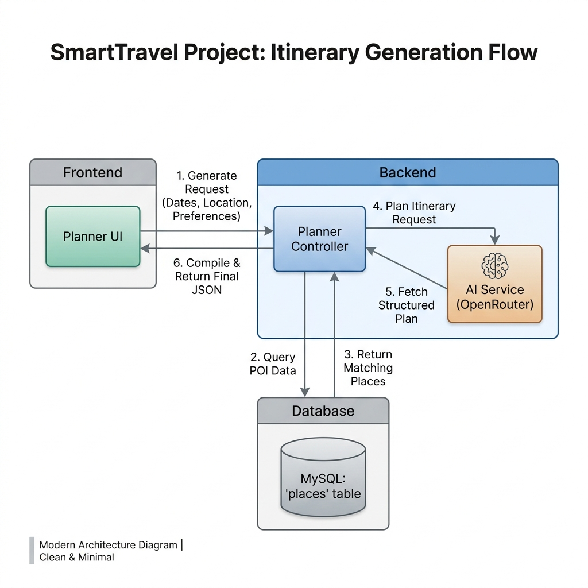
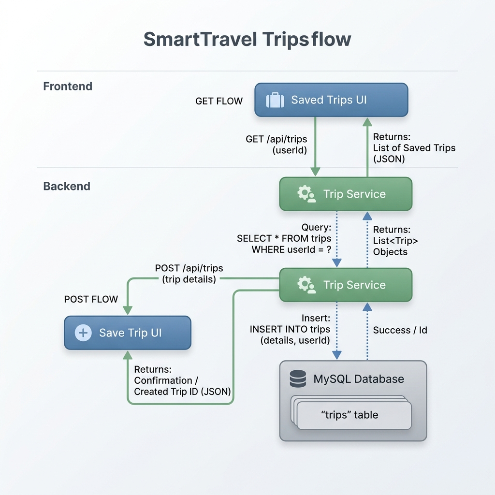

# Diagram Documentation

## Overall System Architecture

## Frontend ↔ Backend ↔ Database Flow

## Authentication Flow

## Itinerary Generation Flow

## Saved Trips Flow

*All diagrams are PNG files placed under `docs/diagrams/`.*
